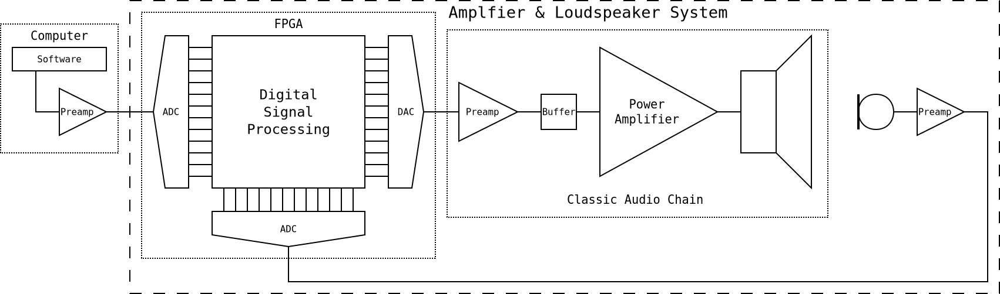
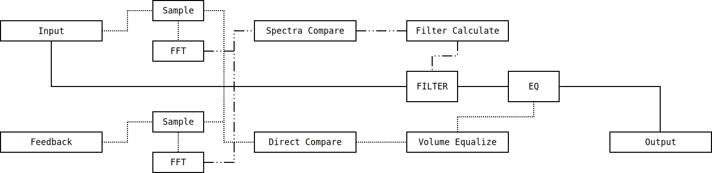

# Real Time Digital Signal Processing

---

# Table of Contents

1.  [Overview](#orgcef6f51)
2.  [Project Goals](#orgf47c858)
3.  [Design](#org47f90d1)
4.  [Rationale](#org748bec1)

# Overview

My favorite classes in high school focused on electrical
engineering. You can find some of my major projects from those classes
in my analog design and processor design repositories. We were meant
to finish senior year with a capstone research project of our own
design. Unfortunately, the year was cut short, causing me and my
classmates to be unable to complete our projects. This repository is a
place for my ongoing efforts to see my senior project through, because
I remain passionate about this work.

For my research topic, I chose real time alteration of audio signals
via digital signal processing (DSP). My goal with this alteration is to
create a system that employs negative feedback to reproduce audio as
close to perfectly as possible, regardless of speaker nonlinearities
or environmental noise. In my high level design, a microphone listens
to the environment while audio is played through speakers. After a
linearity correction, the microphone input is compared to the audio
being played. Based on how closely they match, an algorithm modifies
the audio output to the speakers to bring the actual sound as close as
possible to the intended sound.

The `senior-design` directory contains some of my work from during the
school year. Much of what I worked on was written as notes on paper or
built as test fixtures on a breadboard, but some of what I did is
here. Two diagrams of my system design are present, as is a draft of
my project proposal. In `senior-design/schem` is a Kicad project where
I started designing certain parts of the system in hardware. In
`senior-design/tests` are the data from tests I did to determine the
impedance response curves of different kinds of speakers present in
our lab.

Since the school year abruptly ended, it is difficult for me to work
with hardware. My plans now are to implement a working DSP system in
C, and later in Verilog. I intend to demonstrate the system working as
an application on a general purpose computer, and then explore the
speed increases that are possible by implementing it on a field
programmable gate array (FPGA). My tests and work so far are in the
`sndproc` directory. I will continue to work on this project to study
signal processing and digital design.

# Project Goals

-   Autonomously select a research project and explore part of the
    electrical engineering field in greater depth
-   Design and implement a complete system using an appropriate set of
    techniques and technologies
-   Practice planning a project, drawing designs at various levels, and
    writing to communicate ideas
-   Run tests and experiments to examine a problem and validate possible
    solutions
-   Learn how to use hardware description languages to create digital
    logic in code
-   Simulate various possible designs by writing software and then
    testing performance
-   Create a basic initial system, then iterate to make it faster, more
    robust, and better performing
-   Explore the strategies, algorithms, and past work underlying digital
    signal processing
-   Use negative feedback and other long standing techniques in concert
    to improve heard audio quality
-   Prepare to talk about the project and present it to a group of any
    technical background

# Design

An overall design for my DSP system is depicted in the pair of
diagrams at the top of this document. The first one shows the model of
the entire system, depicting how negative feedback is used. My system
wraps around a regular audio amplifier and speaker circuit, with
digital signal processing prior to the amp and a microphone after
it. The processing algorithm is similar in behavior to one way of
thinking about an operational amplifier, in that it changes its output
according to the inputs in an effort to make the inputs the same.

The second diagram shows, at a high level, the design of the DSP
algorithm. Both inputs are sampled at over 40 kHz, and a fast Fourier
transform (FFT) is run over the samples to examine all of their
spectra. These spectra are compared, and the inconsistencies between
them are used to calculate values for a digital filter. The samples
themselves are compared as well, in order to correct the volume on the
final output and avoid any runaway increase or decrease in signal
amplitude.

By running a digital filter over the input, the collection of
frequencies that make it up will be slightly altered. When done
properly, this should bring the signal fed back from the microphone
into closer agreement with the intended audio, which is the main
input. The filter calculation will be done by a carefully designed
control system fed with present, and possibly past, spectra comparison
results. Designing the algorithm to create the filter appears to be
the most significant challenge of this project.

Most of the work for this project has not yet been completed. I am
confident in my high level designs, but a great deal is left to
explore and create. One of my goals is to understand the discrete
Fourier transform, so I would like to implement my own FFT. I also
need to design the filter calculation control system. Important as
well is the algorithm that converts differences between hundreds of
frequency bucket amplitudes into inputs for the filter control. I
anticipate trade offs here between accuracy and calculation time.

# Rationale

No real environment allows for the perfect reproduction of audio
signals, especially when played through speakers. Various factors
influence the characteristics of the sound that actually reaches our
ears. First, there are no speakers with truly linear response curves,
which means that they play some frequencies louder than other
frequencies. Some integrated systems hardwire a correction for this,
though it is still present for most speakers.

An additional factor is the shape and materials of the environment in
which audio is heard. The vibrations in the air bounce off walls and
are absorbed and blocked by various materials, making the listening
experience different in every room. The environment also contains
noise of its own, including the hum of machines and the noise of
people. The latter has an outsize impact when an environment is
densely packed with people.

I want to create this system to explore whether it is possible to use
digital signal processing algorithms to correct for these distorting
factors as much as possible, in any environment, regardless of the
characteristics of the speaker and microphone hardware being used. The
main prospective issue here is that every microphone has a unique
response curve, in the same way as speakers; however, it may be
possible to correct for this dynamically too.

